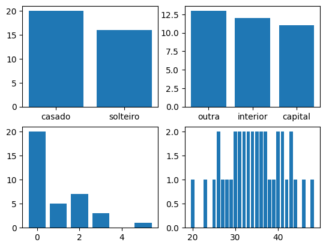
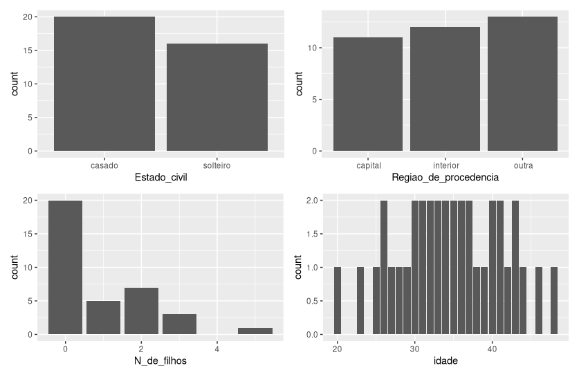
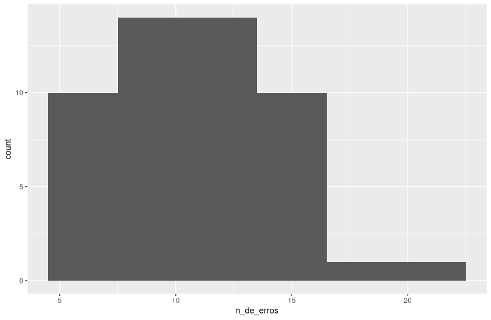

## Tipos de variáveis e escalas de medida

- Variáveis **quantitativas**: aquelas que medem quantidade, ou seja, podem ser representadas por números.

Exemplos: salário, idade, número de pessoas, número de [qualquer coisa]. São divididas entre contínuas e discretas.

- Variáveis **qualitativas**: aquelas que apresentam uma qualidade (ou atributo).

Exemplos: estado civil, nome, região em que se encontra um estado, etc. Para aquelas variáveis que seguem
uma **ordem**, pode-se chamar de variável qualitativa **ordinal**;
caso contrário, é chamada de variável qualitativa nominal (em que apenas se aplica um nome). 

> A variável dicotômica é aquela em que se pode transformar de qualitativa para quantitativa,
pois possui apenas dois valores (0 ou 1, ou solteiro/casado, ou possui carro/não possui carro).

- Para um conjunto de variáveis, é possível retratá-lo a partir de diferentes escalas de medida. A escolha
dos intervalos (ou classes) geralmente é feita a partir da familiaridade com os dados. Os tipos de escalas de medida 
são (repare na similaridade com os tipos de variáveis):

    - Escala nominal: quando a medida se dá um nome (também é possível atribuir números, mas não se pode realizar operações aritméticas).
    - Escala ordinal: quando se pode dizer que uma medida é maior que outra.
    - Escala intervalar: quando a medida pode ser diferente, igual, maior e quanto maior que a outra.
    - Escala de razão: similar à intervalar, com a diferença que agora existe um "zero absoluto". As medidas podem sofrer qualquer operação sem perder o sentido.

> Um exemplo de escala intervalar é a temperatura. Não podemos dizer que 30 graus Celsius é o dobro de 15 graus Celsius, pois
zero graus não é o absoluto nesse caso. Mas transformaríamos em escala de razão caso transformássemos para Kelvin.

> Para escalas nominais e ordinais, a média não é uma boa medida. Para a nominal, a mediana não é uma boa medida.

- Para variáveis qualitativas, os tipos de gráficos viáveis são pizza ou barras.

- Para variáveis quantitativas contínuas, é necessária uma adaptação quando representadas por barras, que é a divisão por classes/intervalos.
Este é chamado de histograma. Uma forma de obter uma visualização perdendo menos informações é usando o gráfico de ramos e folhas.

> Para histogramas, existem fórmulas que são sugestões de quantos intervalos devem existir para um conjunto de dados. Leia sobre Regra de Sturges e Regra da Raiz Quadrada.

<br>
    
## Questões

1. Para cada uma das variáveis abaixo, indique a escala usualmente adotada para resumir os dados em tabelas de frequências:

**a) Salários dos empregados de uma indústria**  
`Escala de razão`

**b) Opinião de consumidores sobre determinado produto**  
`Escala ordinal` (considerando opinião do tipo "ruim/regular/bom" ou escalas como número de estrelas)

**c) Número de respostas certas de alunos num teste com dez itens**  
`Escala de razão`

**d) Temperatura diária da cidade de Manaus**  
`Escala intervalar` (considerando que a escala usual é Celsius)

**e) Porcentagem da receita de municípios aplicada em educação**  
`Escala de razão`

**f) Opinião dos empregados da Companhia MB sobre a realização ou não de cursos obrigatórios de treinamento**  
`Escala nominal dicotômica` (as possibilidades são "sim" ou "não")

**g) QI de um indivíduo**  
`Escala intervalar`

2. Usando os dados da Tabela 2.1, construa a distribuição de frequências das variáveis:

**a) Estado civil.**

**b) Região de procedência.**

**c) Número de filhos dos empregados casados.**

**d) Idade.**

[código da resposta em Python](./questao_2.py)

[código da resposta em R](./questao_2.r)




4. Contou-se o número de erros de impressão da primeira página de um jornal durante 50 dias. Represente os dados graficamente em um histograma e um ramo-e-folhas.

```r
dados <- c( 
  8,11,8,12,14,13,11,14,14,15,
  6,10,14,19,6,12,7,5,8,8,
  10,16,10,12,12,8,11,6,7,12,
  7,10,14,5,12,7,9,12,11,9,
  14,8,14,8,12,10,12,22,7,15)

dados_frame <- data.frame(
  n_de_erros=dados
)

ggplot(dados_frame, aes(x=n_de_erros)) + geom_histogram(binwidth = 3)

stem(data, scale = 2)

# Para facilitar o gráfico de ramos e folhas, vamos ordenar os dados
dados_sorted <- sort(dados)
dados_sorted
# [1]  5  5  6  6  6  7  7  7  7  7  8  8  8  8  8  8  8  9  9 10 10 10 10 10 11 11 11 11 12 12 12 12 12 12 12 12 12
# [38] 13 14 14 14 14 14 14 14 15 15 16 19 22
# a melhor visualização acontece quando dividimos os números por 2 antes de separá-los 
stem(dados, scale=0.5) 
```



| stem | leaf                        |
|------|----------------------------|
| 0    | 5566677777888888899        |
| 1    | 00000111122222222234444444 |
| 1    | 5569                       |
| 2    | 2                          |

5. Usando os resultados do Problema 2 e da Tabela 2.3: construa um histograma para a variável idade; e proponha uma representação gráfica para a variável grau de instrução.

```r
# O histograma para a variável idade possui uma boa visualização quando o intervalo é de 5 anos
ggplot(dados2, aes(x=idade)) + geom_histogram(binwidth = 5)
```


    
`A melhor representação gráfica para o grau de instrução é o de barras ou o de setores (pizza).`
