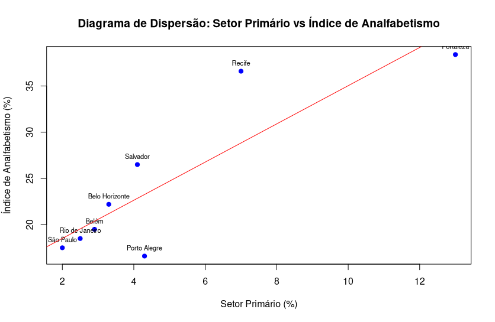

## 3 - Noções de correlação e regressão linear simples

- Para simplificar, o coeficiente de correlação varia entre 0 e 1, ou -1 e 1.

- Resíduos são as diferenças entre os valores observados nos dados e os valores previstos pelo modelo estatístico.

- A fórmula para o qui-quadrado de Pearson pode ser escrita: χ² = ∑Ei ( ( Oi − Ei )² / Ei )
     - Oi => Valor observado
     - Ei => Valor esperado

> O valor esperado vai ser calculado baseado na ideia de que as frequências em porcentagem para cada observação deveriam ser iguais, caso não existisse correlação entre as variáveis.
Por exemplo: se em duas diferentes cidades, 40% das pessoas são mais altas que 170cm, é esperado que cada cidade tenha 20% das pessoas mais altas que 170cm, se fingirmos que não existe relação entre as variáveis cidade e altura.

- Para comparações (limitar para o intervalo 0 |- 1), são utilizados os seguintes coeficientes:

    - coeficiente de contingência: C = √( χ² / n + χ² )
    - coeficiente de Tschuprov: T = √( χ² / n * √((r-1)(s-1)) )
    - coeficiente de Cramér: V = √( χ² / n(q-1) )

- Para variáveis quantitativas, o coeficiente de correlação é dado por: ∑n ( (x - x̄) / dp(x) ) * ((y - ȳ) / dp(y))
    - dp => desvio padrão

- Para a mescla de variável quantitativa X qualitativa, usa-se basicamente as variâncias. Obtém-se a variância global como uma referência, e as variâncias específicas (para cada valor qualitativo) são usadas como comparação.

> var(X)' = ( ∑ n * var(X) ) / ∑ n  => média ponderada das variâncias

- O coeficiente de correlação entre variáveis quantitativa X qualitativa é dado por: R² = ( (Var(X) - Var(X)') / Var(X) )

## Questões

7. Usando os valores da tabela `questao_2.csv`,

    **(a) Construa a distribuição de frequência conjunta para as variáveis grau de instrução e região de procedência.**

```python
import pandas
import numpy
dados = pandas.read_csv("questao_2.csv")

# calculando manualmente
regioes = dados["Regiao_de_procedencia"].str.strip()
graus = dados["Grau_de_instrucao"].str.strip()
dict_tabela = {regiao: {grau: 0 for grau in graus.unique()} for regiao in regioes.unique()}

for regiao, grau in zip(regioes,graus):
    dict_tabela[regiao][grau] += 1

# usando pandas, para conferência
tabela_conjunta = pandas.crosstab(regioes,graus)
print(tabela_conjunta)

```

Regiao_de_procedencia / Grau_de_instrucao   |    ensino fundamental | ensino médio | superior | Total
--------------------------------------------|-----------------------|--------------|----------|--------
capital                                     |                    4  |           5  |       2  |    11
interior                                    |                    3  |           7  |       2  |    12
outra                                       |                    5  |           6  |       2  |    13
Total                                       |                    12 |          18  |       6  |

    **(b) Qual a porcentagem de funcionários que têm o ensino médio?**

```python

porcentagem_ensino_medio = ( 18 / (12 + 18 + 6) ) * 100
print(f"{porcentagem_ensino_medio}% dos funcionários têm ensino médio")
# 50.0% dos funcionários têm ensino médio
```

    **(c) Qual a porcentagem daqueles que têm o ensino médio e são do interior?**

```python
porcentagem_ensino_medio_interior = ( 7 / (12 + 18 + 6) ) * 100
print(f"{porcentagem_ensino_medio_interior:.2f}% dos funcionários têm ensino médio e são do interior")
# 19.44% dos funcionários têm ensino médio e são do interior
```

    **(d) Dentre os funcionários do interior, quantos por cento têm o ensino médio?**

```python
porcentagem_ensino_medio_interior = ( 7 / 18 ) * 100
print(f"{porcentagem_ensino_medio_interior:.2f}% dos funcionários que têm ensino médio são do interior")
# 38.89% dos funcionários que têm ensino médio são do interior
```

    **(e) Calcule o valor de χ² e o coeficiente de contingência C.**

```python
# χ² = ∑Ei ( ( Oi − Ei )² / Ei )
# C = √( χ² / n + χ² )

import pandas
from numpy import sqrt

dados = pandas.read_csv("./B/questao_2.csv")
regioes = dados["Regiao_de_procedencia"].str.strip()
graus = dados["Grau_de_instrucao"].str.strip()

dict_tabela_observados = {
    regiao: {grau: 0 for grau in graus.unique()} for regiao in regioes.unique()
}
for regiao, grau in zip(regioes, graus):
    dict_tabela_observados[regiao][grau] += 1

dict_porcentagem_esperada_por_regiao = {}
for regiao, count in regioes.value_counts().items():
    dict_porcentagem_esperada_por_regiao[regiao] = count / regioes.count()

dict_tabela_esperados = {
    regiao: {grau: 0 for grau in graus.unique()} for regiao in regioes.unique()
}
for regiao, grau in zip(regioes, graus):
    dict_tabela_esperados[regiao][grau] = (
        dict_porcentagem_esperada_por_regiao[regiao] * graus.value_counts()[grau]
    )

qui_quadrado = 0
for regiao, graus_na_regiao in dict_tabela_observados.items():
    for grau, observacao in graus_na_regiao.items():
        qui_quadrado += (
            pow(observacao - dict_tabela_esperados[regiao][grau], 2)
            / dict_tabela_esperados[regiao][grau]
        )

print(f"O valor χ² (qui-quadrado) é: {qui_quadrado}")

contingencia = sqrt(qui_quadrado / (qui_quadrado + regioes.count()))
print(f"O valor C é: {contingencia}")

# O valor χ² (qui-quadrado) é: 0.6614219114219113
# O valor C é: 0.13431812988770833
```


9. A Companhia A de dedetização afirma que o processo por ela utilizado garante um efeito mais prolongado do que aquele
obtido por seus concorrentes mais diretos. Uma amostra de vários ambientes dedetizados foi colhida e anotou-se a duração
do efeito de dedetização. Os resultados estão na tabela abaixo. Você acha que existe alguma evidência a favor ou contra a
afirmação feita pela Companhia A?

Companhia | Menos de 4 meses | De 4 a 8 meses | Mais de 8 meses
----------|------------------|----------------|-----------------
A         | 64               | 120            | 16
B         | 104              | 175            | 21
C         | 27               | 48             | 5

```R
# Para ter certeza, precisamos analisar as porcentagens

transforma_para_porcentagem <- function(lista) {
    sum_ <- 0
    for (a in lista) {
        sum_ <- sum_ + a
    }
    return (lista / sum_)
}

print(transforma_para_porcentagem(c(64,120,16)))
print(transforma_para_porcentagem(c(104,175,21)))
print(transforma_para_porcentagem(c(27,48,5)))

# A [1] 0.32 0.60 0.08
# B [1] 0.3466667 0.5833333 0.0700000
# C [1] 0.3375 0.6000 0.0625


# Entre a empresa A e a B, a A possui maior porcentagem nas durações maiores (acima de 4 meses)
# Entre a empresa A e a C, a A possui maior porcentagem nas durações maiores (acima de 8 meses)
# Portanto, é possível dizer que a evidência está a favor da empresa A, apesar das diferenças serem muito pequenas

```

11. Abaixo estão os dados referentes à porcentagem da população economicamente ativa empregada no setor primário e o
respectivo índice de analfabetismo para algumas regiões metropolitanas brasileiras.
Regiões metropolitanasSetor primárioÍndice de analfabetismo

cidade         | Setor primário | Índice de analfabetismo
---------------|----------------|------------------------
São Paulo      | 2,0            | 17,5
Rio de Janeiro | 2,5            | 18,5
Belém          | 2,9            | 19,5
Belo Horizonte | 3,3            | 22,2
Salvador       | 4,1            | 26,5
Porto Alegre   | 4,3            | 16,6
Recife         | 7,0            | 36,6
Fortaleza      | 13,00          | 38,4

Fonte: Indicadores Sociais para Áreas Urbanas — IBGE — 1977.

    **(a) Faça o diagrama de dispersão.**

```R
cidades <- c("São Paulo", "Rio de Janeiro", "Belém", "Belo Horizonte",
             "Salvador", "Porto Alegre", "Recife", "Fortaleza")

setor_primario <- c(2.0, 2.5, 2.9, 3.3, 4.1, 4.3, 7.0, 13.00)
indice_analfabetismo <- c(17.5, 18.5, 19.5, 22.2, 26.5, 16.6, 36.6, 38.4)

dados <- data.frame(
  Cidade = cidades,
  Setor_Primario = setor_primario,
  Indice_Analfabetismo = indice_analfabetismo
)

plot(dados$Setor_Primario, dados$Indice_Analfabetismo,
     main = "Diagrama de Dispersão: Setor Primário vs Índice de Analfabetismo",
     xlab = "Setor Primário (%)",
     ylab = "Índice de Analfabetismo (%)",
     pch = 19, col = "blue")

text(dados$Setor_Primario, dados$Indice_Analfabetismo,
     labels = dados$Cidade, pos = 3, cex = 0.7)
```



    **(b) Você acha que existe uma dependência linear entre as duas variáveis?**


    **(c) Calcule o coeficiente de correlação.**


    **(d) Existe alguma região com comportamento diferente das demais? Se existe, elimine o valor correspondente e recalcule o coeficiente de correlação.**
