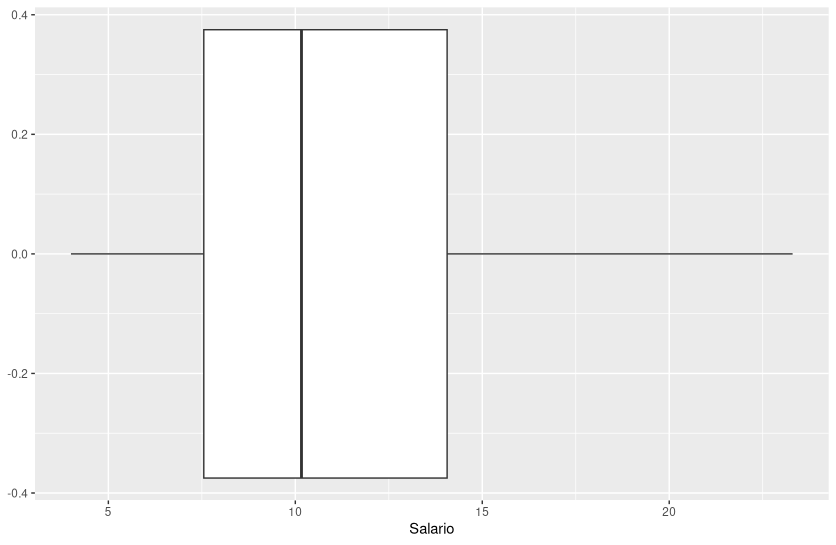

 ## 6 - Interpretação de gráficos (boxplot, histograma, diagrama de dispersão)

 - Boxplots sao diagramas que dao informacoes graficas de varias medidas ao mesmo tempo: mediana, quartil, amplitude e outliers.

11. Construa o box plot para os dados abaixo. O que você pode concluir a respeito da distribuição?

Classe de salários | Frequência ni | Porcentagem 100 fi
-------------------|---------------|-------------------
4,00 - 8,00        | 10            | 27,78
8,00 - 12,00       | 12            | 33,33
12,00 - 16,00      | 8             | 22,22
16,00 - 20,00      | 5             | 13,89
20,00 - 24,00      | 1             | 2,78
Total              | 36            | 100,00

```R

# Para dados agrupados, nao se usa n+1, mesmo o numero de amostras sendo par!!!
posicao_quartil_1 <- 36 / 4  # = 9
posicao_quartil_2 <- posicao_quartil_1 * 2 # = 18
posicao_quartil_3 <- posicao_quartil_1 * 3 # = 27

# ((8 - 4 / 10)) = ((quartil_1 - 4) / 9)
quartil_1 <- (((8 - 4) / 10) * 9) + 4
quartil_1
# [1] 7.6

# ((12 - 8) / 12) = ((quartil_2 - 8) / 8)
quartil_2 <- (((12 - 8) / 12) * 8) + 8
quartil_2
# [1] 10.66667

# 10 + 12 + 8 = 30, entao o terceiro quartil esta no 12 - 16
# ((16 - 12) / 8) = ((quartil_3 - 12) / 5)
quartil_3 <- (((16 - 12) / 8) * 5) + 12
quartil_3
# [1] 14.5

# O valor real vai ser diferente, mas o R nao da a opcao de plotar apenas com o valor dos quartis.
# Entao esse plot vai apenas como referencia

dados = read.csv("questao_2.csv")
ggplot(dados,aes(Salario)) + geom_boxplot()

```


